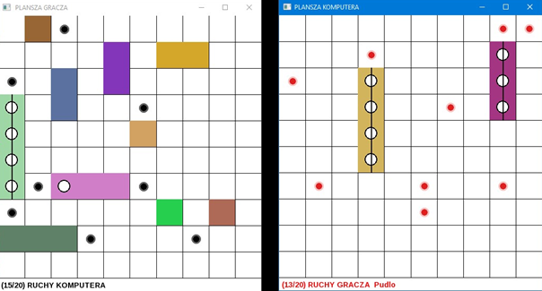
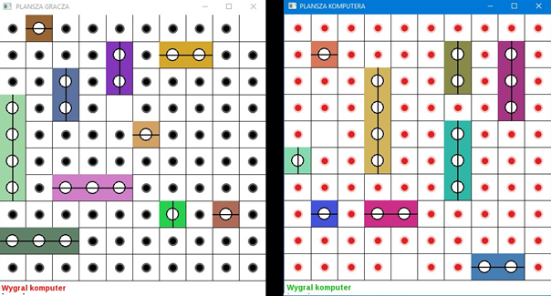

# Ships

## Ogólne informacje
Gra okręty (użytkownik z komputerem). Projekt wymaga udoskonalenia wykonywanych ruchów przez komputer (wykorzystanie elementów sztucznej inteligencji).

## Technologie
* C++
* SFML

